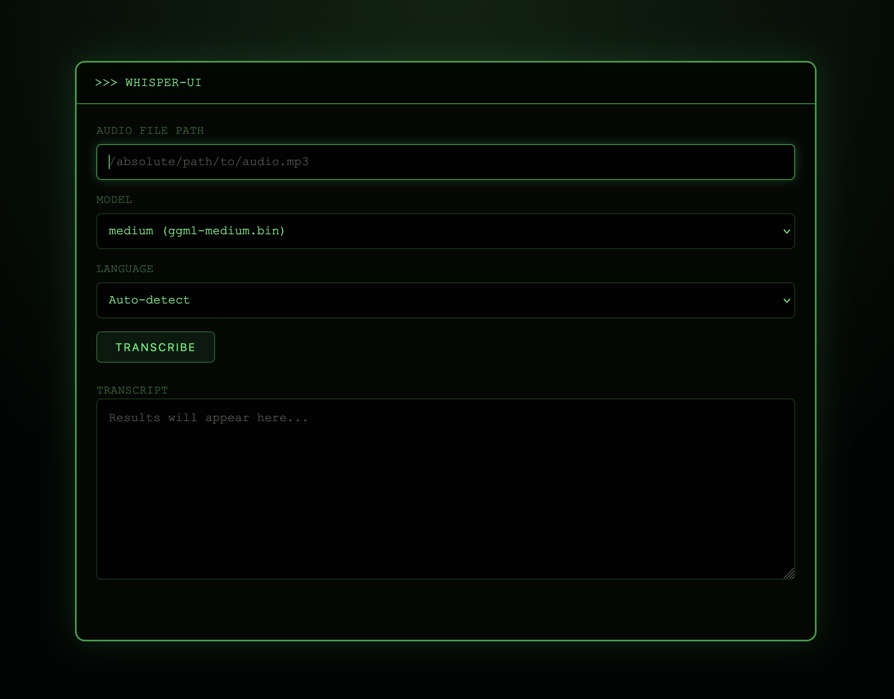

# Whispert - Audio to Text

Offline audio transcription built on top of `whisper.cpp`, with two ways to use it: a fast command-line interface and a simple Flask web UI.

This repository combines the upstream `whisper.cpp` engine with a lightweight browser front end for turning local audio files into text on your own machine.

## What This Project Includes

- Offline speech-to-text with `whisper.cpp`
- CLI transcription for local audio files
- Flask web UI for quick browser-based transcription
- Local model support for `small`, `medium`, `large-v3`, and `large-v3-turbo`
- `ffmpeg`-based audio normalization before transcription in the web UI

## Requirements

- CMake
- A C/C++ compiler
- Python 3
- `ffmpeg`

Optional:

- `make` for shortcut commands like `make small` or `make large-v3`

## Quick Start

### 1. Download a model

```bash
sh ./models/download-ggml-model.sh small
```

You can also download:

- `small`
- `medium`
- `large-v3`
- `large-v3-turbo`

### 2. Build the project

```bash
cmake -B build
cmake --build build -j --config Release
```

### 3. Run a first transcription

```bash
./build/bin/whisper-cli \
  -m models/ggml-small.bin \
  -f samples/jfk.wav
```

## CLI Usage

The main executable is `./build/bin/whisper-cli`.

Supported input formats:

- `wav`
- `mp3`
- `ogg`
- `flac`

Basic transcription:

```bash
./build/bin/whisper-cli \
  -m models/ggml-small.bin \
  -f path/to/audio.mp3
```

Save plain text output:

```bash
./build/bin/whisper-cli \
  -m models/ggml-medium.bin \
  -f path/to/audio.wav \
  -otxt \
  -of output/result
```

Generate subtitles:

```bash
./build/bin/whisper-cli \
  -m models/ggml-large-v3-turbo.bin \
  -f path/to/audio.wav \
  -osrt \
  -ovtt
```

Auto-detect language:

```bash
./build/bin/whisper-cli \
  -m models/ggml-small.bin \
  -f path/to/audio.wav \
  --language auto
```

Useful flags:

- `-m` or `--model`: model file
- `-f` or `--file`: input audio file
- `-otxt`: write `.txt`
- `-osrt`: write `.srt`
- `-ovtt`: write `.vtt`
- `-oj`: write `.json`
- `-of`: output path without extension
- `--language auto`: automatic language detection
- `-nt`: hide timestamps
- `-np`: print only the result text

For best consistency with long or mixed-format audio, convert it to mono 16 kHz WAV first:

```bash
ffmpeg -i input.mp3 -ar 16000 -ac 1 -c:a pcm_s16le output.wav
```

## Web UI

The `UI/` folder contains a small Flask interface that wraps `whisper-cli`.



### Start the UI

Run these commands from the repository root:

```bash
python3 -m venv UI/.venv
source UI/.venv/bin/activate
pip install -r UI/requirements.txt
FLASK_APP=UI.app python -m flask run --host 127.0.0.1 --port 5000
```

Then open:

```text
http://127.0.0.1:5000
```

### How to use the UI

1. Paste an absolute path to a local audio file.
2. Choose a model.
3. Choose the language or leave auto-detect.
4. Click `transcribe`.
5. Read the transcript in the result box.

Important notes:

- The UI does not upload files. It reads a file path from the machine where Flask is running.
- `build/bin/whisper-cli` must exist before the UI can work.
- `ffmpeg` must be installed and available in `PATH`.
- The model dropdown is preconfigured for:
  - `models/ggml-small.bin`
  - `models/ggml-medium.bin`
  - `models/ggml-large-v3.bin`
  - `models/ggml-large-v3-turbo.bin`

If you want different models, edit `MODELS` in `UI/app.py`.

## Model Guide

| Model | Size | Best For |
| --- | --- | --- |
| `small` | 466 MiB | Fast local transcription with low resource use |
| `medium` | 1.5 GiB | Better accuracy for general use |
| `large-v3` | 2.9 GiB | Highest quality, more memory required |
| `large-v3-turbo` | 1.5 GiB | Strong quality/speed balance |

## Project Structure

- `UI/` — Flask web interface
- `examples/cli/` — main CLI application
- `models/` — model download and conversion scripts
- `samples/` — sample audio files
- `src/` and `include/` — core `whisper.cpp` implementation

## Troubleshooting

- If `whisper-cli` is missing or does not run on your machine, rebuild it locally with CMake for your OS and architecture.
- If the UI shows an `ffmpeg` error, install `ffmpeg` and confirm it is available in your shell.
- If the UI says a model is unavailable, download the required `.bin` file into `models/` or update `UI/app.py`.

## License

MIT. See `LICENSE`.

## Credits

This project is based on [ggml-org/whisper.cpp](https://github.com/ggml-org/whisper.cpp), a high-performance C/C++ implementation of OpenAI Whisper.
